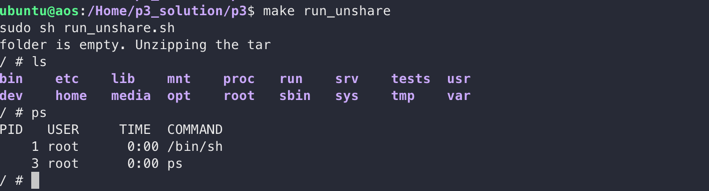
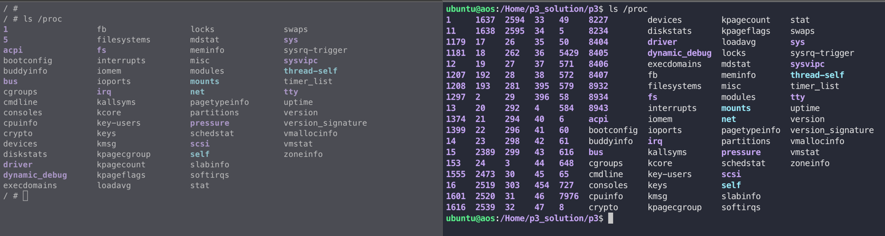
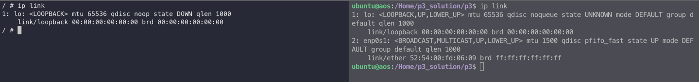
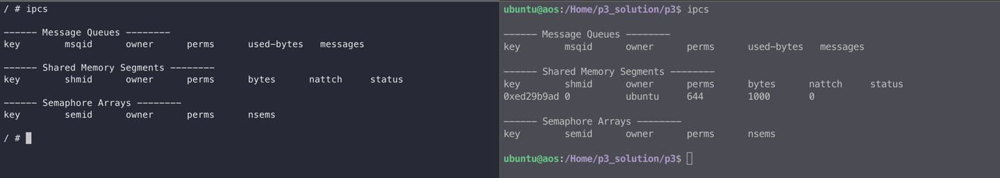

# mini_isolated_env
Creating a complete isolated environment using Chroot.

### Multipass:

Create a new instance in multipass and mount your project directory before getting started. This project uses **Ubuntu 23.04**

### Directories: 
capsule/:  The folder with all the necessary binaries and files to run inside my container.   
root_fs/:  Root for my container.

### Initial steps to create a isolated container:   
1. Run `make capsule` to create the tar of necessary zip files and binaries and tests.

2. Run `make run_unshare` to create the root environment and exec the sandbox environment. A new terminal will open up with /sh.

**Namespaces:**   
Processes cannot access any files or directories other than the ones in the input zipfile and the ls and bash commands.   
The environment's root folder is / and we are not able to access anything before that.

**PID namespace**: All processes in a capsule belong to a single isolated process namespace with process ids starting at 1.
 

**Mount namespace**: Processes in a capsule have their own private mount namespace.

**Network namespace**: None of the processes in a capsule have access to any network interface.

**IPC namespace**: Processes in a capsule have their own IPC resources.

**CGroups**:   
For the below 3 tests, open a different terminal and run `make cgroups` to set and unset cgroups.

a) The total CPU utilization of all processes in a capsule cannot exceed 5% at any point in time.    
Run `cd tests && python3 test_cpu.py`

b) The total memory usage of all processes in a capsule cannot exceed 2 MB.    
Run `sh mem.sh`

c) The maximum disk read/write rate of processes in a capsule is 1 MB/sec.   
Run `sh disks.sh`

### Incorporating networking in capsule:

After creating a capsule, 
1. Run `make net_ns_h1` to setup the network connections.
2. Inside the sandbox environment, run `ping 8.8.8.8`. This should connect to the server and the ping should succeed.

#### TCP Connection between same and different hosts:     
Same hosts:
1. Let's create two or more capsules and let them communicate with one other.    
2. Run `make run_unshare` in two different terminals to open two capsules and run `make net_ns_h1` in the third terminal to setup the network connections.    
3. Try pinging capsule1 from capsule2 and vise versa. The ping should succeed.    
4. Run the `sh tests/tcp_server.sh` in capsule1 and `sh tests/tcp_server.sh` capsule2 to set a tcp communication.     

Different hosts:

1. Let's have two hosts. VM1 and VM2    
2. VM1 with capsule1. In VM1, Run `make unshare` in one terminal and `make net_ns_h1` in another terminal.     
3. VM2 with capsule2. In VM2, Run `make unshare` in one terminal and `make net_ns_h2` in another terminal.      
4. *Modify run_ip_routes.sh with the required IP and run `sh run_ip_routes.sh` to complete the network setup.     
5. Try pinging capsule1 in VM1 from capsule2 in VM2 and vise versa. The ping should succeed.      
6. Run the `sh tests/tcp_server.sh` in capsule1 and `sh tests/tcp_server.sh` capsule2 to set a tcp communication.

## Jailbreak:

To break out of the chroot jail,

1. Run `make`, and inside the jailed env, run `./jailbreak`.
2. It comes out of the jailed environment and returns back to the host's user directory as a root user.
